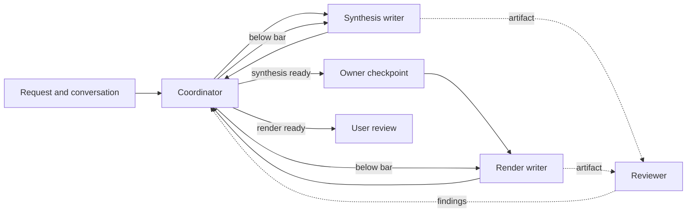

# Mental Model V2 Prompt Design

**Status:** Approved
**Owner:** Reid
**Date:** 2026-09-06
**Input:** `mental-model-v2.md`

## Overview

Mental Model V2 keeps four jobs: decide when work is ready, build the explanation, check it against accumulated feedback, and render it visually. The coordinator owns quality. It judges every iteration as the user would and withholds work that is not ready for user review.

The reviewer remains a narrow pattern checker. It extracts relevant lessons from a growing feedback history without making that history the writer's objective.

## Problem

The current prompt tells the coordinator to read the artifact and own quality, but its stopping rule asks whether another cycle would improve the work. That permits known defects without requiring the artifact to clear the user's bar. In practice, the coordinator has verified requested changes without judging the result as a reader.

Large rule sets cause a second failure: writers optimize for visible checks while purpose, sequence, and readability recede. Adding another check after each failure makes this worse.

## Goals

- Make the coordinator accountable for whether every artifact is ready for the user.
- Preserve a reviewer that finds relevant patterns in shared and project-local feedback.
- Give each writer a clear purpose, responsibility, context boundary, and output contract.
- Keep prompts short enough that the agent must exercise judgment.
- Preserve current context boundaries, numbering, and render bookkeeping inside a separate v2 command and artifact namespace.
- Make user corrections improve judgment across the artifact and later iterations.

## Non-Goals

- Redesign the runtime, adapter, or installation flow beyond registering the separate v2 skill.
- Replace judgment with a score, rubric, ledger, or retry count.
- Merge synthesis and rendering.
- Ask the reviewer to judge readiness, verify source facts, or edit artifacts.

## Principles

### One owner of readiness

The coordinator reads the artifact, considers the review, and applies its current understanding of the user. No other signal grants a pass.

### Feedback informs without taking over

Only the reviewer searches the full feedback history. Writers receive their existing project-local guidance. The coordinator receives review findings, not feedback files.

### Prompts define jobs, not thought procedures

Each prompt states the goal, responsibility, context boundary, hard constraints, and output. A criterion belongs in the prompt when it is part of the role's objective and valid for every artifact. Conditional examples and techniques stay in feedback for the reviewer to filter. This keeps broad standards for a good explanation without turning every historical lesson into a checklist.

## Core Model

Both loops follow one rule: the coordinator reads the artifact and review, then decides whether the artifact is ready. The reviewer never routes work or ends a loop.

## Prompt Contracts

### 1. Coordinator

**File:** `claude-pack/skills/_my_mental_model_v2/SKILL.md`

**Scope:** Own the run, route work among the other roles, maintain the owner checkpoint, inspect rendered output, and decide readiness on every iteration.

**Requirements:**

- [OWNER] Judge every initial and revised artifact against the best current understanding of the user from the skill goal, request, conversation, and user feedback.
- [OWNER] Gate user review. Do not advance below-bar work, and do not lower the bar because of attempt count.
- [OWNER] Read every candidate directly and form an independent opinion. Reviewer findings are advisory, and a clean review does not grant a pass.
- [OWNER] Treat a user correction as evidence about the whole artifact and the user's expectations, then apply it across later judgment.
- [OWNER] Preserve the browser gate, review naming, and render bookkeeping.
- [INHERITED] Preserve the owner checkpoint, context routing, artifact naming pattern, and render choices inside the v2 namespace.
- [INHERITED] Only the producing writer revises an artifact; every revision brief carries the current review, and owner corrections are carried in the owner's words.
- [AGENT] If the workflow cannot clear the bar, report the failure and remaining gap instead of presenting the artifact as ready.

**Draft prompt:**

- You own the quality of everything this workflow presents to the user.
- Infer the user's standard from this skill's purpose, their request, the conversation, and all feedback they give during the run.
- Read every initial and revised artifact as the intended reader. Decide whether it is faithful, clear, coherent, useful, and ready for that user.
- Use the reviewer's findings as evidence. The reviewer detects patterns; it does not decide readiness.
- If the artifact is below the bar, give the original writer one coherent brief about the whole artifact, reference the current review, and review the revision again. Continue until it clears the bar or the workflow fails; there is no fixed attempt limit.
- Carry owner corrections in their words. Use each correction to update your understanding of their expectations wherever relevant now and later.
- Advance only when your own judgment says the artifact is ready. For HTML, read the source and inspect every visual in a browser before release. If the workflow cannot clear the bar, report failure and the remaining gap.
- Retain the current operational sections for context classification, fresh-agent dispatch, original-writer ownership, the mandatory checkpoint, paths, review naming, render choices, failure handling, feedback capture, and bookkeeping.

### 2. Synthesis Writer

**File:** `claude-pack/skills/_my_mental_model_v2/design_synthesis.md`

**Scope:** Build the mental model and teaching sequence from source material before visual presentation choices dominate the work.

**Why it exists:** Source order is rarely teaching order. This role decides what the reader must understand, why the parts exist, how they relate, and where uncertainty remains.

**Requirements:**

- [INHERITED] Produce one markdown synthesis and no HTML.
- [INHERITED] Explain a mental model rather than inventorying files or paraphrasing sources.
- [INHERITED] Cover the assigned context policy, preserve claim provenance and gaps or disagreements, and leave useful source pointers.
- [INHERITED] Preserve the synthesis-to-render interface: named metadata, a narrative skeleton, source pointers, visual cues, and a plain `# Judgment` section.
- [OWNER] Read project-local synthesis feedback and never shared feedback.
- [OWNER] Keep criteria in the prompt when they define a good mental model in every case; keep conditional examples and techniques in feedback.

**Draft prompt:**

- Produce one markdown synthesis for the assigned question. Do not produce HTML.
- Reconstruct the model a reader needs: what the system is, why it has this shape, how its parts interact, and where its boundaries or uncertainties are.
- Write for an intelligent reader who lacks the source context: put what matters first, decompose the model into understandable concepts, and add detail top-down. Choose a teaching sequence instead of following source order.
- Cover architecture, runtime behavior, or both as assigned. Ground important claims with source pointers, state their authority, distinguish current code from intended design, and preserve contradictions or missing evidence.
- Give the render writer a strong narrative skeleton, the details worth expanding, and visual opportunities that clarify the model.
- Use project-local synthesis feedback as guidance. Do not read shared feedback.
- Retain the existing metadata fields, section-level source-pointer and visual-cue interface, and plain `# Judgment` contract. Remove fixed counts that do not carry meaning.
- Write only to the assigned path. The saved markdown is the whole output.

### 3. Reviewer

**File:** `claude-pack/skills/_my_mental_model_v2/review.md`

**Scope:** Inspect one artifact for prompt violations and relevant historical feedback patterns. Return findings without editing the artifact or judging readiness.

**Why it exists:** The feedback corpus acts like lightweight fine-tuning. A fresh reviewer recovers relevant lessons without flooding the writer's context or turning feedback into the writing objective.

**Requirements:**

- [OWNER] Be the only role that reads both shared and project-local feedback.
- [INHERITED] Start fresh and domain-blind; do not read sources, hidden project context, or the conversation.
- [OWNER] Find concrete prompt violations, repeated negative feedback patterns, and missed positive techniques that clearly apply.
- [AGENT] Report only clear matches, group repeated instances, and ground each finding in an artifact location and rule or feedback entry.
- [OWNER] Stay advisory: do not edit, prescribe the whole revision, issue a verdict, or stop the loop.
- [INHERITED] Ignore trailing render bookkeeping and write only to the assigned review path without overwriting it; the coordinator chooses the unnumbered first path and later numbered paths.
- [INHERITED] Preserve the current review-file shape, `No findings.` result, path-only success return, and `FAILURE:` envelope.

**Draft prompt:**

- Review the artifact as a fresh, domain-blind pattern checker.
- Read only the artifact, its writer prompt, the verbatim user question, and the supplied shared and project-local feedback files.
- Find concrete prompt violations, repeated negative feedback patterns, and missed positive techniques that clearly apply.
- Include a feedback technique only when the artifact clearly shows that it applies. Do not force weak analogies.
- For each finding, cite the artifact location and the prompt rule or feedback entry that grounds it. Group repeated instances of one problem.
- Do not fact-check against project sources, rewrite the artifact, design the revision, or judge readiness.
- Ignore trailing `# Renders` bookkeeping. Write only to the assigned review path and never overwrite it.

### 4. Render Writer

**File:** `claude-pack/skills/_my_mental_model_v2/visualize.md`

**Scope:** Turn an approved synthesis into one readable, source-grounded HTML artifact. Own visual explanation, hierarchy, supporting detail, and accessible page behavior.

**Why it exists:** A sound narrative does not determine its presentation. This role decides what should become a diagram, example, table, disclosure, or prose. The coordinator verifies the result in a browser.

**Requirements:**

- [INHERITED] Produce exactly one standalone HTML file from the approved synthesis.
- [INHERITED] Preserve the mental model and narrative while adding source-grounded detail from its pointers.
- [INHERITED] Make visuals and prose one reading experience; choose visual forms because they clarify the content.
- [INHERITED] Keep uncertainty visible, avoid invented facts, preserve source disagreements, and omit internal provenance grades from reader-facing HTML.
- [OWNER] Read project-local synthesis and HTML feedback and never shared feedback.
- [INHERITED: current prompt] Preserve the exact standalone-output, safety, accessibility, output-path, and reporting contracts. The coordinator retains the checkpoint and browser inspection.

**Draft prompt:**

- Produce exactly one standalone HTML explanation from the approved synthesis.
- Preserve its mental model and teaching sequence. Use its source pointers to add the detail a reader needs.
- Design one coherent reading experience. Use diagrams, examples, tables, navigation, or progressive disclosure where they make the explanation easier to follow.
- Give every visual a clear job and connect it to the prose. Do not add forms merely to satisfy a catalog.
- Keep uncertainty and source disagreement visible. Do not invent facts or quietly choose a side.
- Use project-local synthesis and HTML feedback as guidance. Do not read shared feedback.
- Omit internal provenance grades from the HTML while expressing meaningful uncertainty in reader-facing language.
- Retain the existing self-contained rules for standalone output, prohibited content, secrets, accessibility, exact output path, no-overwrite behavior, and the return envelope.

## What Changes

| Area | Today | V2 |
|---|---|---|
| Roles and artifact boundaries | Four distinct jobs | Keep |
| Feedback access | Reviewer reads shared and local; writers read relevant local files | Keep |
| Coordinator access | Artifacts and reviews, not feedback files | Keep |
| Checkpoint, render choices, artifact naming, numbering, bookkeeping | Established behavior | Keep inside a separate v2 command and output namespace |
| Readiness | A review loop may stop with known findings | Coordinator withholds work until it clears the user-review bar |
| User correction | Becomes revision input | Also recalibrates whole-artifact judgment |
| Prompt style | Detailed rules, fixed shapes, self-checks | Keep always-relevant objective criteria, interfaces, and hard constraints; move conditional examples and techniques to feedback |

## Lifecycle

1. The coordinator classifies the request and briefs the synthesis writer with the existing context boundary.
2. The synthesis writer creates the markdown. A fresh reviewer checks it against its prompt and both feedback tiers.
3. The coordinator reads both outputs and judges the synthesis. Below bar means a consolidated brief to the original writer, followed by another fresh review and judgment.
4. Once the synthesis clears the gate, the coordinator pauses for owner review as it does today.
5. The chosen render writer creates HTML. A fresh reviewer checks it, and the coordinator reads the source, inspects every visual in a browser, and runs the same judgment loop.
6. The coordinator presents the render only after it clears the gate.
7. User feedback updates the coordinator's standard for the entire artifact and future iterations. A mental-model correction reopens synthesis; a presentation correction reopens rendering.

## Edge Cases

- **Reviewer has no findings or fails:** The coordinator still judges the artifact; absence of findings never grants a pass.
- **Reviewer overreaches:** The coordinator uses grounded findings and ignores verdicts or revision plans.
- **Local feedback reveals a general expectation:** The coordinator applies it wherever the same condition exists without inventing unrelated requirements.
- **Writer stops improving:** The coordinator reports failure and remaining defects rather than presenting below-bar work as ready.
- **Comparison render:** Judge each candidate independently and present only candidates that clear the bar.
- **Source contradiction:** Writers expose it; the coordinator does not reward hiding it.

## Architectural Bets

- The coordinator already has the request and live conversation, so it can learn the user's standard without an expectation ledger.
- Separate synthesis protects the explanatory model from source order and presentation concerns.
- Separate rendering gives visual communication and browser behavior a clear owner.
- A narrow reviewer contains the large feedback corpus while preserving its value as pattern memory.

## Decision Record

- **ADR 0013:** Records the approved coordinator gate and asymmetric feedback routing as one coupled decision.
- **ADR 0012 remains active:** Its prompt-rule versus feedback-technique boundary is preserved rather than replaced.

## Prior Art

- `mental-model-v2.md` supplies owner-settled gate behavior, feedback access, and preserved bookkeeping, plus agent-proposed rationale for the four roles.
- ADR 0009 supplies the directory skill with sibling prompt and feedback files; ADR 0011 supplies Claude-native prompts and recursive Codex adaptation.
- ADR 0012 keeps standalone rules in prompts and attributed examples or techniques in feedback. V2 preserves that split: prompts hold criteria inherent to the role's objective and valid for every artifact; feedback holds conditional patterns for the reviewer to match.
- `mental-model-review-loop/spec.md` and `mental-model-quality-ownership/change.md` supply fresh review, original-writer revision, and coordinator-authored direction. V2 strengthens their stopping condition.
- `mental-model-visual-validation/change.md` supplies browser inspection of every visual.

## System Confidence

- **High:** The package already has the required roles, routing, loops, checkpoint, numbering, render comparison, and browser validation.
- **Medium:** Shorter prompts should protect judgment, but behavior scenarios must confirm that the remaining contracts are sufficient.
- **Low:** One writer may fail to cross the bar after repeated revisions. V2 makes that failure honest but does not add writer replacement.

## Validation

- Test the gate language, whole-artifact recalibration, advisory reviewer boundary, and preserved feedback access structurally.
- Keep current structural tests for packaging, adaptation, fresh Codex spawns, reviewer presence, and the browser gate. Add checks for other preserved contracts where structural testing is useful.
- Run four behavior scenarios: mechanically compliant but unreadable synthesis; a local figure fix with the same defect elsewhere; an empty review; and a writer that stops improving.
- Verify that the coordinator reads and judges each artifact, gives consolidated direction, and withholds below-bar work.

## Owner Amendments After Approval

- **[OWNER] 2026-09-06:** V2 is a separate command and its outputs do not collide with v1 so both can run in parallel. This replaces the design's original same-command and same-directory assumption; v2 uses `/_my_mental_model_v2`, `my-mental-model-v2`, and `.project/mental-alignment-v2/`.
- **[OWNER] 2026-09-07:** Put important information up front. Do not assume the reader finishes the artifact; at every stopping point, they should already have consumed the most important available information for understanding.
- **[OWNER] 2026-09-07:** Use references to later sections when a concept appears before its full explanation.
- **[OWNER] 2026-09-07:** Preserve outcome-quality guidance while removing prescribed thought process and arbitrary form. The outcome includes one-read clarity, claim-bearing headings, inspectable reasoning, correct abstraction layers, definitions separated from measurements, evidence-backed rationale, concrete source-grounded expansion, self-contained visuals, visible main flow, useful navigation, and explicit current-versus-intended distinctions.
- **[OWNER] 2026-09-07:** Specificity belongs in the synthesis itself. Name every important thing and say exactly what it is and what is true about it, including the invariants and the actual data structures that define important types. Explicit grounding also includes code shapes, data models, signatures, class structures, and meaningful real numbers where relevant. The HTML expands these specifics; it does not introduce them for the first time.
- **[OWNER] 2026-09-07:** The first v2 A/B run failed because it mirrored the owner's includes list, accumulated detail instead of selecting it, buried the strongest example, and provided no transitions between information dumps. Coverage is not structure. The synthesis must build one central mental model, choose a teaching sequence, use a strong example early, connect sections into a story, and stop adding detail once the point has landed.

## Handoff

Detailed design should map each draft bullet to the smallest edit in the four authored prompt files, list current instructions retained or removed, update tests around responsibilities rather than exact prose, and mark obsolete reviewer-topology language as superseded.
