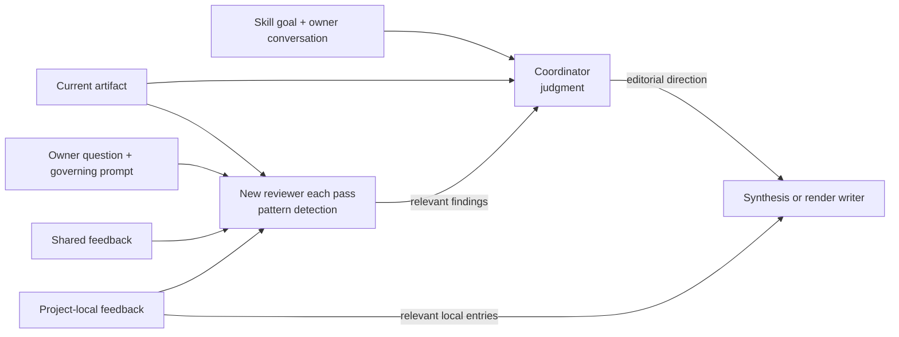
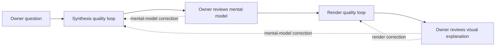
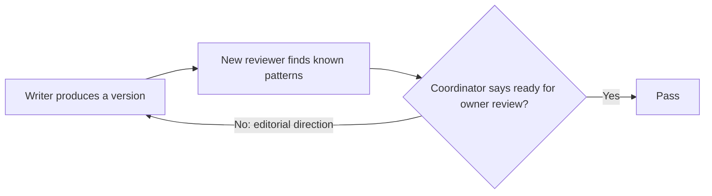

# Concept: Mental Model v2

**Created:** 2026-09-06
**Status:** Draft

## Problem

The current skill has the right agents but weakens their roles with too much procedure. The coordinator can complete the process without deciding that the work is good enough for the owner. The synthesis and render prompts prescribe so much form that agents can satisfy the instructions while producing a poor explanation.

Historical feedback creates a second tension. It improves detection of recurring problems, but showing the whole corpus to the coordinator would pull its attention away from the current goal. V2 keeps the reviewer as the only reader of both feedback tiers and makes the coordinator the owner-informed judge and gate.

## Owner's Words

- **[OWNER-VERBATIM]** “the reviewer is supposed to find examples of violated patterns and rules.”
- **[OWNER-VERBATIM]** “the coordinator needs to actually OWN THE OUTPUT.”
- **[OWNER-VERBATIM]** “each piece of feedback should not result in a localized fix, but also a better ‘judge’”
- **[OWNER-VERBATIM]** “the feedback list is like our ‘fine-tuning’”
- **[OWNER-VERBATIM]** “For ANY AND ALL iterations, tt must act as a judge based on what it thinks the user is looking for”
- **[OWNER-VERBATIM]** “it must act as a GATE: willing to take multiple iterations until the judgement bar is cleared for user review”
- **[OWNER]** Prompts should define clear goals and responsibilities, retain only important process, and let agents exercise judgment.

## Success Criteria

1. **[OWNER] Every iteration is judged** — The coordinator judges each initial or revised synthesis and render against its current understanding of the owner's expectations.
2. **[OWNER] The judgment is a gate** — The workflow advances only when the coordinator believes the artifact is ready for owner review.
3. **[OWNER] The gate has no fixed retry count** — Attempts do not justify releasing work below the bar. **[AGENT]** A run succeeds only by clearing the gate; recovery from an incapable writer remains open.
4. **[OWNER] Feedback improves the judge** — An owner correction changes the coordinator's judgment of the whole artifact for the rest of the run.
5. **[OWNER] The full feedback history stays isolated** — Only the reviewer reads both shared and project-local feedback. Synthesis and render writers retain their relevant project-local feedback; the coordinator receives filtered findings.
6. **[OWNER] The reviewer remains advisory** — It detects grounded prompt and feedback matches but cannot pass the artifact.
7. **[OWNER] Prompts stay small** — They define purpose, responsibility, and hard boundaries without prescribing how to think.

## Why Four Roles Exist

**[INHERITED: `.project/concepts/mental-alignment-checkpoint.md`, Success Criteria 2, 3, and 12]** Synthesis and rendering remain separate roles, and the synthesis writer may resume as the render writer. **[AGENT]** The four roles separate kinds of attention: synthesis decides what the explanation is; rendering decides how an approved explanation becomes visual and detailed.

| Role | Owns | Context it needs | Why it is separate |
|---|---|---|---|
| **Coordinator** | Readiness for owner review | Skill goal, full conversation, current feedback, artifact, filtered review | It alone can judge the work against the owner's evolving expectations. |
| **Synthesis writer** | The mental model and narrative | Owner question, permitted sources, synthesis goal, project-local synthesis feedback | It gets dedicated attention for understanding the system before presentation choices distort the explanation. |
| **Reviewer** | Detection of known failure patterns | Artifact, governing prompt, shared and project-local feedback | It absorbs the full feedback history without making that corpus the coordinator's objective. |
| **Render writer** | The visual explanation and detail layer | Approved synthesis, source pointers, render goal, project-local synthesis and HTML feedback | It chooses how to show a settled explanation and can spend its context on detail, layout, and visual relationships. |

## Feedback Boundary

Only the reviewer sees both tiers. Writers see relevant project-local feedback, while the coordinator sees neither feedback file directly.

## Prompt Coverage

| Prompt | Must establish | Keep out |
|---|---|---|
| **Coordinator** | Overall outcome; owner-informed judgment; gate on every iteration; reviewer is advisory; revisions continue until the bar clears; current feedback sharpens whole-artifact judgment; context and render routing; hard operational boundaries | Historical feedback corpus; writing checklist; fixed retry count; permission to advance on procedural completion |
| **Synthesis** | Owner question and source policy; project-local synthesis feedback; reconstruct how and why the subject works; choose the narrative and abstractions; ground claims and expose gaps; produce an independently readable skeleton with source pointers and separate judgment | HTML production; shared feedback; layout decisions; detailed form recipes |
| **Reviewer** | Owner question; artifact and governing prompt; both feedback tiers; report grounded violations, relevant pattern matches, and relevant techniques missed; group repeated instances; findings are advisory | Conversation and domain sources; factual judgment; pass/fail authority; artifact editing |
| **Render** | Approved synthesis and source restriction; project-local synthesis and HTML feedback; preserve its argument; add source-grounded detail; make visuals and prose one reading experience; static HTML, safety, provenance, and accessibility boundaries | Shared feedback; catalog of mandatory visuals; duplicated synthesis-writing rules |

**[AGENT] Prompt reduction remains a proposal.** ADR 0012 currently says generalized rules belong in prompts and examples belong in feedback. Specification must decide which current rules are essential and which are conditional techniques for reviewer detection.

## Full Lifecycle

Both quality loops use the same gate:

| Outside the main flow | Preserved behavior |
|---|---|
| **Before synthesis** | Coordinator states the context policy and output shape; clean-room restrictions define the synthesis sources. |
| **At the synthesis pause** | Owner chooses resumed, fresh, or both render paths and whether clean-room restrictions also govern rendering. |
| **At either owner review** | A correction reopens the relevant loop. Recording a reusable lesson is a separate, optional action. |
| **Inside the render gate** | Coordinator reads the HTML and inspects it in a browser before passing it. |
| **After rendering** | Plain-document judgment is read in conversation; comparison readings and requested feedback are recorded. |

## Current Skill → V2

Owner-originated and inherited dispositions are marked in the surrounding concept. Unmarked v2 changes in this table are **[AGENT]** proposals for owner review.

| Area | Current | V2 | Disposition |
|---|---|---|---|
| Major stages | Classify → synthesis loop → owner pause and optional feedback → render loop → owner review and optional feedback → record | Same | **Keep** |
| Coordinator | Owns quality; asks whether another cycle would improve the artifact | Judges every version against its understanding of the owner and blocks progress below that bar | **Transform** |
| Stopping rule | Can stop below the owner's bar when another cycle seems unhelpful | Successful stop requires clearing the gate; writer failure is reported separately | **Replace** |
| Reviewer | Fresh, domain-blind check against prompt and feedback | Same role, with relevant matches grouped and weak analogies omitted | **Keep and sharpen** |
| Feedback exposure | Reviewer reads both tiers; writers read relevant project-local feedback; coordinator reads neither file | Same | **Keep** |
| Revision handoff | Coordinator writes an outcome-level fixing prompt that references the review | Make the coordinator's interpretation and owner-informed judgment explicit | **Keep and sharpen** |
| Owner correction | Fix named issue; recording is separate | Fix the issue and update the coordinator's judgment of the whole artifact | **Transform** |
| Synthesis role | Independent mental model and HTML skeleton | Same | **Keep** |
| Synthesis prompt | Fixed structure plus extensive writing rules and self-checks | Preserve purpose, evidence, provenance, source pointers, and judgment; **[AGENT]** reduce form recipes | **Keep core; propose cuts** |
| Synthesis pause | Owner reviews before rendering | Same, after coordinator gate | **Keep** |
| Render role | Preserve narrative and add a real detail layer | Same | **Keep** |
| Render prompt | Detail-layer goal plus extensive layout and prose rules | Preserve narrative, evidence, safety, and accessibility; **[AGENT]** reduce layout recipes | **Keep core; propose cuts** |
| Render validation | Generic review loop, semantic checks, and browser inspection are split across sections | One coordinator gate covers writing, visuals, safety, reviewer findings, and browser result | **Unify** |
| Context, shape, render routes | Four context policies, two output shapes, three render routes | Same | **Keep** |
| Feedback persistence | Project-local first; owner-directed promotion sorts rules and examples | Same; persistence is separate from current-run learning | **Keep and clarify** |
| Comparison readings | Wall clock, reported tokens, owner quality assessment | Same | **Keep** |
| Review-file numbering and render bookkeeping | Numbered review history, artifact naming, and render readings | **[OWNER]** Same; it works and does not materially affect the quality problem v2 addresses | **Keep** |

## Scope

### Change

- **[AGENT]** `SKILL.md` — make the coordinator's owner-informed judgment the gate on every iteration and simplify the surrounding procedure.
- **[AGENT]** `design_synthesis.md` — clarify the synthesis role and reduce form prescriptions after the prompt-boundary decision.
- **[AGENT]** `review.md` — preserve isolated feedback matching and make its advisory boundary explicit.
- **[AGENT]** `visualize.md` — clarify the render role and reduce layout prescriptions after the prompt-boundary decision.
- **[AGENT]** Runtime adapters and tests — preserve Claude/Codex parity and only the operational contracts the skill needs.

### Preserve

- **[INHERITED: `.project/concepts/mental-alignment-checkpoint.md`]** Context policies, output shapes, synthesis pause, render routes, paired run artifacts, feedback tiers, promotion rules, judgment separation, and the HTML detail-layer requirement.
- **[INHERITED: `.project/active/mental-model-visual-validation/change.md`]** Browser inspection before the coordinator releases HTML.

### Out of scope

- **[OWNER]** A scoring rubric, expectation ledger, editorial checklist, fixed retry count, removal of the reviewer, or giving both feedback tiers to the coordinator.
- **[AGENT]** Automated prose scoring, runtime redesign, and model selection.

## Open Questions

1. **[AGENT] Prompt boundary:** Which generalized synthesis and render rules remain essential, and which current techniques move behind reviewer isolation? This may amend ADR 0012.
2. **[AGENT] Failed execution:** If one writer repeatedly misses the bar, does the coordinator retry it, replace it with a fresh writer, or report failure?
3. **[AGENT] Naming:** The current epic already uses `MENTAL-ALIGN-V2`; downstream work needs a distinct implementation label or an explicit supersession.

## Next-Stage Handoff

**Settled:** **[OWNER]** Keep the reviewer as isolated historical-feedback memory. Make the coordinator the owner-informed judge and gate for every iteration. Let that judgment evolve with the conversation. Keep prompts focused on goals, roles, responsibilities, and essential process.

**Needs specification:** Resolve the three open questions, then write the smallest prompt changes that make the role model and gate observable without recreating a checklist.

## Sources

- `claude-pack/skills/_my_mental_model/{SKILL.md,design_synthesis.md,review.md,visualize.md}`
- `.project/concepts/mental-alignment-checkpoint.md`
- `.project/adr/0012-mental-model-prompt-feedback-split-and-reviewer.md`
- `.project/active/mental-model-review-loop/spec.md`
- `.project/active/mental-model-visual-validation/change.md`
